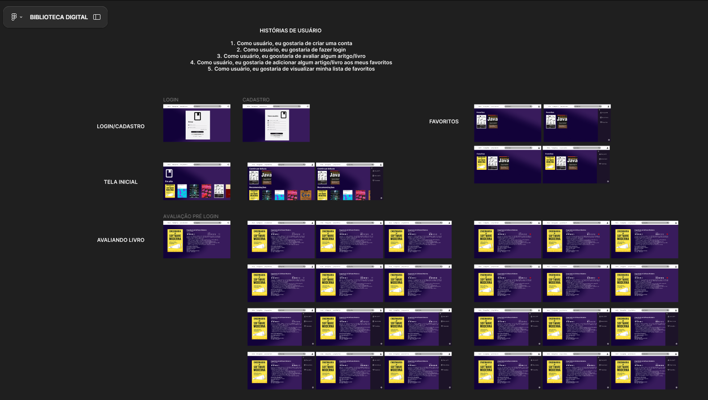

# BIBLIOTECA DIGITAL 📚💻

O objetivo principal é criar uma plataforma online onde os usuários possam acessar, de maneira fácil e gratuita (ou com um custo acessível), uma vasta coleção de livros, artigos, papers acadêmicos e outros materiais relacionados à área da tecnologia, como programação, inteligência artificial, cibersegurança, engenharia de software, entre outros.

# Tecnologias utilizadas 🛠️🛠
    1 - JIRA
  
    2 - FIGMA
  
    3 - CANVA
# Quadro Biblioteca Digital 🧠🧠

# Protótipo projetado 🚀

        LINK para o protótipo: 

# Painel do Jira

# Screencast
[Screencast](https://www.youtube.com/watch?v=lTM1rb4GnJ8)

# Integrantes
    - Eduardo Braga
    - Henrique Franca
    - Isabela Medeiros
    - Júlia Vilar
    - Júlia Vilela
    - Pedro Marques
    - Rafael Angelim
